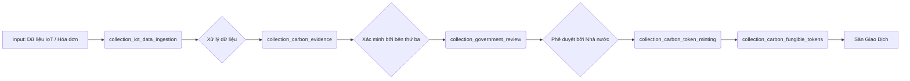

# 📄 README: Hệ Thống Sàn Giao Dịch Tín Chỉ Carbon

> **Phiên bản:** 1.0  
> **Tác giả:** Joshept  
> **Năm:** 2025  
> **Mục tiêu:** Xây dựng một hệ sinh thái minh bạch, tự động hóa từ thu thập dữ liệu → xác minh → cấp tín chỉ → giao dịch → kê khai thuế, tuân thủ pháp luật Việt Nam.

---

## MỤC LỤC

1.  [Giới thiệu Tín Chỉ Carbon (Dành cho Tiến sĩ)](#-1-giới-thiệu-tín-chỉ-carbon-dành-cho-tiến-sĩ)
2.  [Kiến trúc Hệ Thống Tổng Quan](#-2-kiến-trúc-hệ-thống-tổng-quan)
3.  [Luồng Dữ Liệu & Input Đầu Vào (Input)](#-3-luồng-dữ-liệu--input-đầu-vào-input)
4.  [Tiêu Chí & Phương Pháp Đánh Giá Chất Lượng Tín Chỉ Carbon](#-4-tiêu-chí--phương-pháp-đánh-giá-chất-lượng-tín-chỉ-carbon)
    - 4.1. Các Phương Pháp Luận (Methodology) Phổ Biến
    - 4.2. Công Thức Tính Toán Giảm Phát Thải (Có Ví Dụ)
    - 4.3. Tiêu Chí “Thêm Vào” (Additionality) và “Không Rò Rỉ” (No Leakage)
5.  [Quy Trình Tạo Hồ Sơ Gửi Đơn Vị Kiểm Kê (Government Review)](#-5-quy-trình-tạo-hồ-sơ-gửi-đơn-vị-kiểm-kê-government-review)
6.  [Quy Trình Giao Dịch Token trên Sàn](#-6-quy-trình-giao-dịch-token-trên-sàn)
7.  [Tuân Thủ Pháp Luật & Kê Khai Thuế](#-7-tuân-thủ-pháp-luật--kê-khai-thuế)
8.  [Kết Luận & Hướng Phát Triển](#-8-kết-luận--hướng-phát-triển)

---

## 1. Giới thiệu Tín Chỉ Carbon 

### Tín chỉ carbon là gì?
Một **tín chỉ carbon** đại diện cho **một tấn CO₂ (hoặc khí nhà kính tương đương) đã được loại bỏ, tránh phát thải hoặc hấp thụ khỏi khí quyển**. Đây là một **công cụ tài chính** giúp các doanh nghiệp hoặc quốc gia “bù trừ” lượng khí thải của họ bằng cách đầu tư vào các dự án giảm phát thải ở nơi khác.

### Ví dụ thực tế:
> Một nông dân trồng lúa áp dụng kỹ thuật “tưới khô ướt xen kẽ” (AWD) giúp giảm phát thải khí methane (CH₄) – một loại khí nhà kính mạnh hơn CO₂ 25 lần. Lượng khí CH₄ giảm được sẽ được **tính toán, xác minh** và **chuyển đổi thành tín chỉ carbon**. Nông dân có thể **bán tín chỉ này** cho một công ty đang cần bù trừ lượng khí thải của mình.

### Tại sao cần hệ thống này?
- **Minh bạch:** Mọi bước từ dữ liệu thô → tín chỉ → giao dịch đều được ghi nhận và xác minh.
- **Tự động hóa:** Giảm thiểu can thiệp thủ công, giảm sai sót.
- **Tuân thủ:** Đáp ứng yêu cầu pháp lý của cơ quan nhà nước và cơ quan thuế.
- **Tạo giá trị:** Biến hành động bảo vệ môi trường thành tài sản có thể giao dịch.

---

## 2. Kiến trúc Hệ Thống Tổng Quan

Hệ thống gồm 3 tầng chính:

1.  **Tầng Thu Thập & Xử Lý Dữ Liệu (Data Layer):**
    -   `collection_iot_data_ingestion`: Thu thập dữ liệu từ cảm biến (IoT).
    -   `collection_carbon_evidence`: Lưu trữ minh chứng đã được xử lý.
    -   `collection_carbon_program_enrollment`: Quản lý thông tin đăng ký dự án carbon.

2.  **Tầng Xác Minh & Cấp Tín Chỉ (Verification & Issuance Layer):**
    -   `collection_government_review`: Tạo và quản lý hồ sơ gửi cơ quan nhà nước.
    -   `collection_carbon_token_minting`: Đúc token/NFT sau khi được phê duyệt.
    -   `collection_carbon_fungible_tokens`: Lưu trữ token ERC-20 có thể giao dịch.

3.  **Tầng Giao Dịch & Tài Chính (Trading & Finance Layer):**
    -   `collection_carbon_orders`: Quản lý lệnh mua/bán.
    -   `collection_carbon_transactions`: Ghi nhận giao dịch.
    -   `collection_tax_documents` & `collection_tax_monthly_filings`: Tự động tính toán và kê khai thuế.

---

## 3. Luồng Dữ Liệu & Input Đầu Vào (Input)

### Nguồn dữ liệu đầu vào (Input):

| Nguồn Input                 | Collection Tiếp Nhận       | Mô tả                                                                 |
| --------------------------- | -------------------------- | --------------------------------------------------------------------- |
| **Cảm biến IoT**            | `collection_iot_data_ingestion` | Dữ liệu mực nước, độ ẩm đất, hình ảnh vệ tinh... từ trang trại.       |
| **Hóa đơn/Giấy tờ**         | `collection_carbon_evidence`    | Hóa đơn mua phân hữu cơ, ảnh chụp hiện trường, báo cáo kiểm toán...   |
| **Thông tin đăng ký dự án** | `collection_carbon_program_enrollment` | Tên dự án, phương pháp luận, diện tích, loại cây trồng...             |
| **Thông tin người dùng**    | `collection_users`              | Họ tên, CCCD, địa chỉ, ví blockchain, mã số thuế...                   |

### Luồng xử lý dữ liệu:


---

## 4. Tiêu Chí & Phương Pháp Đánh Giá Chất Lượng Tín Chỉ Carbon

### 4.1. Các Phương Pháp Luận (Methodology) Phổ Biến

Hệ thống hỗ trợ nhiều phương pháp luận quốc tế. Mỗi phương pháp có **bộ công thức và hướng dẫn riêng** để tính toán lượng khí thải giảm được.

| Mã Phương Pháp | Tên đầy đủ                     | Áp dụng cho                     | Cơ quan ban hành |
| -------------- | ------------------------------ | ------------------------------- | ---------------- |
| `VM0042`       | Rice Cultivation               | Dự án trồng lúa                 | Verra (VCS)      |
| `VCS-Agro`     | Agricultural Land Management   | Quản lý đất nông nghiệp         | Verra (VCS)      |
| `AMS-II.G`     | Demand-side activities         | Hoạt động tiết kiệm năng lượng  | Gold Standard    |

---

### 4.2. Công Thức Tính Toán Giảm Phát Thải (Có Ví Dụ)

#### 🌾 Ví dụ: Tính giảm phát thải CH₄ từ trồng lúa (VM0042)

**Công thức chung:**
```
Lượng CH₄ giảm = Diện tích (ha) × Số ngày áp dụng AWD thành công × Hệ số giảm phát thải (kg CH₄/ha/ngày)
```

**Trong hệ thống:**

-   **Input:** Dữ liệu IoT (`iot_data_type: "water_level"`) ghi nhận mực nước ruộng.
-   **Xử lý:** Hệ thống đếm số ngày mực nước < 15cm (ngày áp dụng AWD thành công).
-   **Tính toán:**
    ```js
    // Logic trong pipeline của collection_iot_data_ingestion
    if (methodology === 'VM0042' && dataType === 'water_level') {
        processed.days_below_threshold = rawData.values.filter(v => v < 15).length;
        processed.measured_value = processed.days_below_threshold * 0.5; // 0.5 kg CH4/ha/ngày là hệ số giả định
        processed.unit = 'kg CH4';
    }
    ```
-   **Output:** Giá trị `measured_value` (kg CH₄) được lưu vào `collection_carbon_evidence`.

**Chuyển đổi sang tCO₂e:**
Khí methane (CH₄) có chỉ số GWP (Global Warming Potential) là 25 trong 100 năm. Tức là 1kg CH₄ = 25kg CO₂e.
```
Tín chỉ carbon (tCO₂e) = (Lượng CH₄ giảm (kg) × 25) / 1000
```

---

### 4.3. Tiêu Chí “Thêm Vào” (Additionality) và “Không Rò Rỉ” (No Leakage)

Đây là 2 tiêu chí **bắt buộc** để một dự án được cấp tín chỉ carbon.

-   **Thêm Vào (Additionality):** Dự án **chỉ xảy ra khi có tín chỉ carbon**. Nếu nông dân đã áp dụng AWD từ trước mà không cần bán tín chỉ, thì dự án này **không đạt tiêu chí thêm vào**.
    -   *Hệ thống đảm bảo:* Khi đăng ký dự án (`collection_carbon_program_enrollment`), người dùng phải khai báo rõ ràng các “thay đổi thực hành” (`practice_changes`) và thời điểm bắt đầu áp dụng.

-   **Không Rò Rỉ (No Leakage):** Việc giảm phát thải ở **địa điểm A** không được gây ra phát thải tăng thêm ở **địa điểm B**.
    -   *Hệ thống đảm bảo:* Hồ sơ gửi nhà nước (`collection_government_review`) sẽ bao gồm bản đồ dự án và đánh giá tác động vùng lân cận (nếu có).

---

## 5. Quy Trình Tạo Hồ Sơ Gửi Đơn Vị Kiểm Kê (Government Review)

### Bước 1: Thu thập & Xác minh Minh chứng
-   Dữ liệu IoT và tài liệu được xử lý và lưu vào `collection_carbon_evidence`.
-   Trạng thái `verification_status` phải là `"verified"` bởi một tổ chức kiểm toán độc lập.

### Bước 2: Tự động Tổng hợp Hồ sơ
-   Pipeline `create_gov_review_from_verified_evidence` trong `collection_government_review` sẽ:
    1.  Tìm tất cả minh chứng đã verified liên quan đến một dự án (`enrollment_id`).
    2.  Tính tổng lượng tín chỉ đề nghị cấp (`calculated_credits`).
    3.  Tạo một bản ghi hồ sơ mới với `review_status: "pending_submission"`.

### Bước 3: Gửi Hồ sơ cho Cơ quan Nhà nước
-   Người dùng hoặc hệ thống cập nhật thông tin gửi (`submitted_to_authority`) và đổi `review_status` thành `"submitted"`.
-   Hồ sơ bao gồm:
    -   Danh sách minh chứng (`evidence_list`).
    -   Tổng lượng tín chỉ đề nghị (`calculated_credits`).
    -   Tài liệu hỗ trợ (`supporting_documents`: báo cáo, bản đồ...).

### Bước 4: Chờ Phê Duyệt
-   Khi cơ quan nhà nước phản hồi, hệ thống gọi pipeline `update_review_status_from_authority` để cập nhật:
    -   `review_status: "approved"` (hoặc `"rejected"`).
    -   `approval_date`, `approved_by`, `official_seal_hash` (mã hash con dấu điện tử).

---

## 6. Quy Trình Giao Dịch Token trên Sàn

Sau khi được phê duyệt, hệ thống sẽ:

1.  **Đúc Token (Minting):**
    -   Tạo **NFT** (đại diện cho chứng chỉ gốc, không thể chia nhỏ) → Lưu trong `collection_carbon_token_minting`.
    -   Tạo **Token ERC-20** (VNCR, có thể chia nhỏ, giao dịch) → Lưu trong `collection_carbon_fungible_tokens`.
    -   Cập nhật số dư ví người dùng trong `collection_carbon_wallet_balances`.

2.  **Giao dịch:**
    -   Người dùng đặt lệnh mua/bán trong `collection_carbon_orders`.
    -   Hệ thống khớp lệnh và ghi nhận giao dịch trong `collection_carbon_transactions`.
    -   Cập nhật lại số dư ví (`collection_carbon_wallet_balances`).

---

## 7. Tuân Thủ Pháp Luật & Kê Khai Thuế

Hệ thống phân biệt rõ 2 loại thu nhập để tính thuế:

| Loại Giao Dịch      | Loại Chứng Từ (`doc_type`) | Thuế GTGT | Thuế TNCN (Hộ KD) |
| ------------------- | -------------------------- | --------- | ----------------- |
| Bán Nông sản        | `sale_agri`                | 5%        | 0.5% - 2%*        |
| Bán Token Carbon    | `sale_token`               | **0%**    | **2%** (tạm tính) |

> *Tỷ lệ TNCN tùy ngành nghề theo Thông tư 40/2021/TT-BTC.

**Quy trình tự động:**
1.  Mỗi giao dịch tạo ra một chứng từ thuế (`collection_tax_documents`).
2.  Hệ thống tổng hợp chứng từ theo tháng và tạo tờ khai (`collection_tax_monthly_filings`).
3.  Nông dân và kiểm toán viên ký điện tử (QR Code) để xác nhận.
4.  Hồ sơ được gửi tới cơ quan thuế và chờ phê duyệt.

---

## 8. Kết Luận & Hướng Phát Triển

Hệ thống này là một **giải pháp toàn diện**, biến **hành động nông nghiệp bền vững** thành **tài sản kỹ thuật số có giá trị**, đồng thời đảm bảo **minh bạch, tuân thủ pháp luật và tạo thu nhập thực tế cho người nông dân**.

### Hướng phát triển:
-   Tích hợp AI để dự báo và tối ưu lượng tín chỉ.
-   Mở rộng sang các lĩnh vực khác: chăn nuôi, lâm nghiệp, năng lượng tái tạo.
-   Kết nối với các sàn giao dịch carbon quốc tế.

---

**Tài liệu này được thiết kế để in ra và trình bày.** Nó cung cấp đủ thông tin cho cả kỹ sư để triển khai và cho nhà quản lý (tiến sĩ) để hiểu bản chất và giá trị của hệ thống.

--- 
